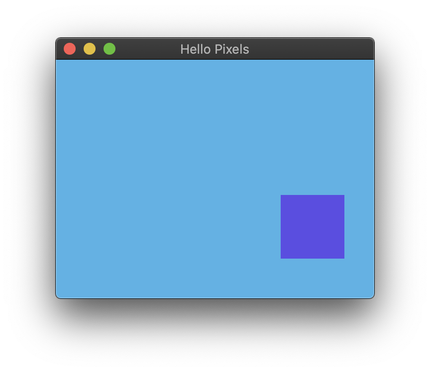

# Hello Pixels



Minimal example with `glfw`.

## Running

```bash
cargo run --release --package minimal-glfw
```

## About

This example demonstrates the absolute minimum for creating a `glfw` window and pixel buffer. It animates a purple box moving on a blue background, just for _something_ interesting to display.

TODO: macOS support in `glfw` is very broken. See: https://github.com/glfw/glfw/issues/1251
