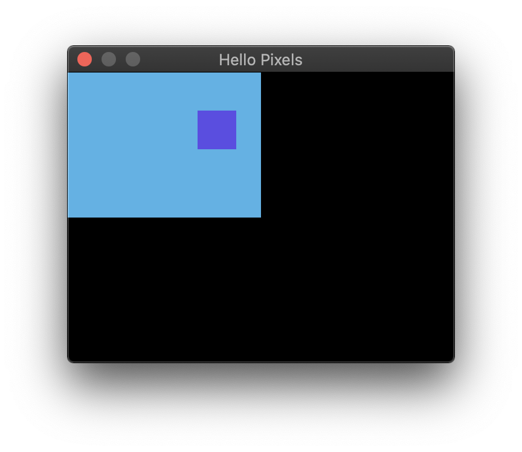

# Hello Pixels



Minimal example with `minifb`.

## Running

```bash
cargo run --release --package minimal-minifb
```

## About

This example demonstrates the absolute minimum for creating a `minifb` window and pixel buffer. It animates a purple box moving on a blue background, just for _something_ interesting to display.

TODO: There is a bug with High-DPI displays (see screen shot). `minifb` does not provide information regarding the DPI scale factor. A workaround (if you happen to know the DPI scaling factor on your system) is resizing the `SurfaceTexture`:

```rust
let surface_texture =
    SurfaceTexture::new(window_size.0 as u32 * 2, window_size.1 as u32 * 2, &window);
```
